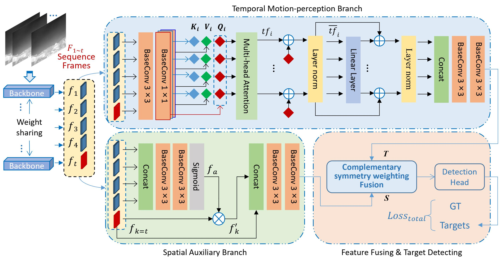
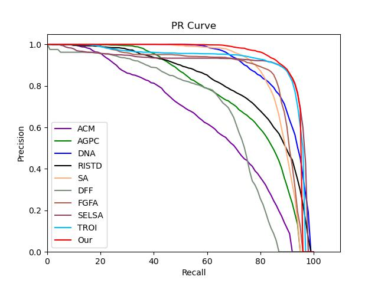
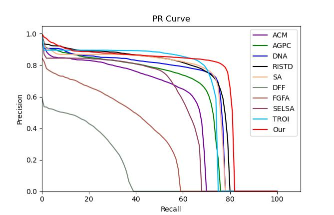

# TMP: Temporal Motion Perception with spatial auxiliary enhancement for moving Infrared dim-small target detection

## Model
||
|:--:|
|*TMP*|

## PR results on the DAUB and IRDST datasets

|  |
|:--:|
| *DAUB* |

|  |
|:--:|
| *IRDST* |


## Datasets
### 1. Datasets are available at [DUAB](https://www.scidb.cn/en/detail?dataSetId=720626420933459968) , [IRDST](https://xzbai.buaa.edu.cn/datasets.html) and [ITSDT](https://www.scidb.cn/en/detail?dataSetId=de971a1898774dc5921b68793817916e&dataSetType=journal)

### 2. The COCO format need to convert to txt format.
``` python 
python utils_coco/coco_to_txt.py
```
### 3. The folder structure should look like this:
```
Dataset
├─coco_train.txt
├─coco_val.txt
├─annotations
├─images
│   ├─train
│   │   ├─data5
│   │   │   ├─0.bmp
│   │   │   ├─ ...
│   │   │   ├─2999.bmp
│   │   │   ├─ ...
│   │   ├─ ...
│   ├─test
│   │   ├─data6
│   │   │   ├─0.bmp
│   │   │   ├─ ...
│   │   │   ├─398.bmp
│   │   │   ├─ ...
│   │   ├─ ...
```
### 3. The class of dataset should write to a txt file. 
Such as model_data/classes.txt

## Train
The hyper-parameters are set in train.py
```python 
python tarin.py
```

## Evaluate
The hyper-parameters are set in vid_map_coco.py
```python 
python vid_map_coco.py
```

## Visualization
The hyper-parameters are setted in vid_predcit.py
```python 
python vid_predcit.py
```

## Reference
https://github.com/bubbliiiing/yolox-pytorch/
